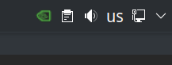

# GPU Icon

Exactly what says in the tin. Its a GPU icon for your system tray



## Requirements

- [glxinfo](https://dri.freedesktop.org/wiki/glxinfo/)
- [yad](https://github.com/v1cont/yad)
- [X11](https://www.x.org/wiki/) (unfortunately Wayland is not supported by YAD yet)
- [curl](https://curl.se/) (for quick install only)
- [sudo](https://www.sudo.ws/) (for quick install only)

## Quick install

```sh
curl ...; sudo mv ./gpuicon /usr/bin/gpuinfo; sudo chmod +x /usr/bin/gpuinfo
```

then `gpuicon` to launch it

## Why you built this?

I have a laptop with hybrid graphics and a mux switch. That means that I can switch in BIOS which graphics card I want to run, if I want performance or battery life. And I needed a easy way to see which graphics card was running in a easy way.

Then gpuicon was born, the idea is just to display an icon with the current running graphics card on your system tray, i've added a simple information dialog once you've clicked on the icon allowing you to see glxinfo details if you want.

This script was made with simplicity in mind, not much dependencies to run, it uses `glxinfo` to get information for the current GPU and `yad` to display the notification icon.

## The icon show a question mark instead of my GPU icon

I've added support for some major graphics cards manufacturers but not all, if your graphics card is not supported a question mark icon will be shown. Since I dont have the hardware to get all vendor information I will be adding new cards as available.

If you want to help support your graphics card please do open a new issue with your GPU details and a copy of `glxinfo`. You can get it by clicking in the *gpuicon* and using the *GLXInfo* button.

The following GPUs are currently supported:
- [AMD](https://www.amd.com/)
- [NVIDIA](https://www.nvidia.com)
- [VMWare](https://www.vmware.com/)
- [Software Rendering](https://docs.mesa3d.org/drivers/llvmpipe.html)

## I cannot close gpuicon

When you click in the icon a Window with some details of your graphics is shown but theres no quit option. If you want to quit *gpuicon* just middle-click on it and it will close away.
